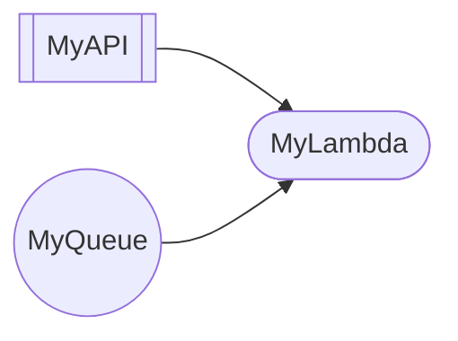

# Cloudmaid 🧜‍♀️☁️

A strongly-typed AWS CloudFormation to Mermaid parser, built in Rust 🦀. Generates mermaid diagrams showing data flow between AWS resources.

## Supported AWS Resources 🚀

- AWS::Lambda::Function
- AWS::SQS::Queue
- AWS::ApiGateway::Method
- AWS::Lambda::EventSourceMapping

## Usage 💻

```bash
cargo run -- --input-file template.json --output-file diagram.md
```

Example output:


## Architecture 🏗️

### Core Data Flow 
1. **CLI parsing** (clap) → **Template deserialization** (serde_json) → **Edge extraction** → **Mermaid generation** 📊

### AST Structure 🌳

The core `AST` type now uses a simple edge-based approach optimized for Mermaid diagram generation:

```rust
pub struct AST {
  pub edges: Vec<(Node, Node)>,
}
```

where the tuple of `Node` are representing the from-to relationship.

### CloudFormation Processing ☁️

```rust
pub struct Template {
  pub resources: Vec<Resource>,
}
```

## Development 🛠️

- **Build**: `cargo build` 🔨
- **Test**: `cargo test` ✅
- **Format**: `cargo fmt` 💅
- **Run**: `cargo run -- --input-file <INPUT> --output-file <OUTPUT>` 🚀

## Contributing 🤝

Contributions more than welcome! 🎉

