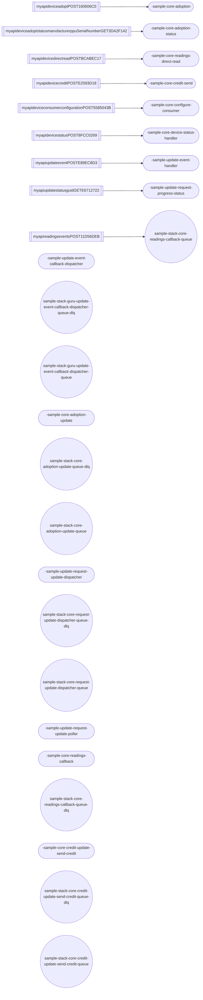

```mermaid
flowchart LR

myapideviceadoptPOST160606C0[[myapideviceadoptPOST160606C0]]
myapideviceadoptstatusmanufacturerppuSerialNumberGET3DA2F142[[myapideviceadoptstatusmanufacturerppuSerialNumberGET3DA2F142]]
myapidevicedirectreadPOSTBCABEC17[[myapidevicedirectreadPOSTBCABEC17]]
myapidevicecreditPOSTE2593D18[[myapidevicecreditPOSTE2593D18]]
myapideviceconsumerconfigurationPOST5585043B[[myapideviceconsumerconfigurationPOST5585043B]]
myapidevicestatusPOST8FCC0269[[myapidevicestatusPOST8FCC0269]]
myapiupdateeventPOSTE89EC8D3[[myapiupdateeventPOSTE89EC8D3]]
myapiupdatestatusguidGETE6712722[[myapiupdatestatusguidGETE6712722]]
myapireadingseventsPOST11D56DEB[[myapireadingseventsPOST11D56DEB]]
-sample-core-adoption([-sample-core-adoption])
myapideviceadoptPOST160606C0[[myapideviceadoptPOST160606C0]] --> -sample-core-adoption([-sample-core-adoption])
-sample-core-readings-direct-read([-sample-core-readings-direct-read])
myapidevicedirectreadPOSTBCABEC17[[myapidevicedirectreadPOSTBCABEC17]] --> -sample-core-readings-direct-read([-sample-core-readings-direct-read])
-sample-update-event-handler([-sample-update-event-handler])
myapiupdateeventPOSTE89EC8D3[[myapiupdateeventPOSTE89EC8D3]] --> -sample-update-event-handler([-sample-update-event-handler])
-sample-update-event-callback-dispatcher([-sample-update-event-callback-dispatcher])
sample-stack-guru-update-event-callback-dispatcher-queue-dlq((sample-stack-guru-update-event-callback-dispatcher-queue-dlq))
sample-stack-guru-update-event-callback-dispatcher-queue((sample-stack-guru-update-event-callback-dispatcher-queue))
-sample-core-adoption-update([-sample-core-adoption-update])
sample-stack-core-adoption-update-queue-dlq((sample-stack-core-adoption-update-queue-dlq))
sample-stack-core-adoption-update-queue((sample-stack-core-adoption-update-queue))
-sample-update-request-update-dispatcher([-sample-update-request-update-dispatcher])
sample-stack-core-request-update-dispatcher-queue-dlq((sample-stack-core-request-update-dispatcher-queue-dlq))
sample-stack-core-request-update-dispatcher-queue((sample-stack-core-request-update-dispatcher-queue))
-sample-update-request-update-poller([-sample-update-request-update-poller])
-sample-update-request-progress-status([-sample-update-request-progress-status])
myapiupdatestatusguidGETE6712722[[myapiupdatestatusguidGETE6712722]] --> -sample-update-request-progress-status([-sample-update-request-progress-status])
-sample-core-adoption-status([-sample-core-adoption-status])
myapideviceadoptstatusmanufacturerppuSerialNumberGET3DA2F142[[myapideviceadoptstatusmanufacturerppuSerialNumberGET3DA2F142]] --> -sample-core-adoption-status([-sample-core-adoption-status])
-sample-core-readings-callback([-sample-core-readings-callback])
sample-stack-core-readings-callback-queue-dlq((sample-stack-core-readings-callback-queue-dlq))
sample-stack-core-readings-callback-queue((sample-stack-core-readings-callback-queue))
myapireadingseventsPOST11D56DEB[[myapireadingseventsPOST11D56DEB]] --> sample-stack-core-readings-callback-queue((sample-stack-core-readings-callback-queue))
-sample-core-credit-send([-sample-core-credit-send])
myapidevicecreditPOSTE2593D18[[myapidevicecreditPOSTE2593D18]] --> -sample-core-credit-send([-sample-core-credit-send])
-sample-core-credit-update-send-credit([-sample-core-credit-update-send-credit])
sample-stack-core-credit-update-send-credit-queue-dlq((sample-stack-core-credit-update-send-credit-queue-dlq))
sample-stack-core-credit-update-send-credit-queue((sample-stack-core-credit-update-send-credit-queue))
-sample-core-configure-consumer([-sample-core-configure-consumer])
myapideviceconsumerconfigurationPOST5585043B[[myapideviceconsumerconfigurationPOST5585043B]] --> -sample-core-configure-consumer([-sample-core-configure-consumer])
-sample-core-device-status-handler([-sample-core-device-status-handler])
myapidevicestatusPOST8FCC0269[[myapidevicestatusPOST8FCC0269]] --> -sample-core-device-status-handler([-sample-core-device-status-handler])
```