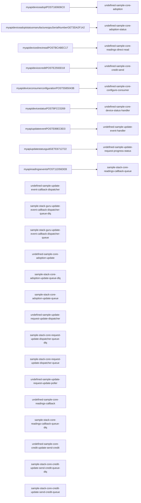

```mermaid
flowchart LR

myapideviceadoptPOST160606C0
myapideviceadoptstatusmanufacturerppuSerialNumberGET3DA2F142
myapidevicedirectreadPOSTBCABEC17
myapidevicecreditPOSTE2593D18
myapideviceconsumerconfigurationPOST5585043B
myapidevicestatusPOST8FCC0269
myapiupdateeventPOSTE89EC8D3
myapiupdatestatusguidGETE6712722
myapireadingseventsPOST11D56DEB
undefined-sample-core-adoption
myapideviceadoptPOST160606C0 --> undefined-sample-core-adoption
undefined-sample-core-readings-direct-read
myapidevicedirectreadPOSTBCABEC17 --> undefined-sample-core-readings-direct-read
undefined-sample-update-event-handler
myapiupdateeventPOSTE89EC8D3 --> undefined-sample-update-event-handler
undefined-sample-update-event-callback-dispatcher
sample-stack-guru-update-event-callback-dispatcher-queue-dlq
sample-stack-guru-update-event-callback-dispatcher-queue
undefined-sample-core-adoption-update
sample-stack-core-adoption-update-queue-dlq
sample-stack-core-adoption-update-queue
undefined-sample-update-request-update-dispatcher
sample-stack-core-request-update-dispatcher-queue-dlq
sample-stack-core-request-update-dispatcher-queue
undefined-sample-update-request-update-poller
undefined-sample-update-request-progress-status
myapiupdatestatusguidGETE6712722 --> undefined-sample-update-request-progress-status
undefined-sample-core-adoption-status
myapideviceadoptstatusmanufacturerppuSerialNumberGET3DA2F142 --> undefined-sample-core-adoption-status
undefined-sample-core-readings-callback
sample-stack-core-readings-callback-queue-dlq
sample-stack-core-readings-callback-queue
myapireadingseventsPOST11D56DEB --> sample-stack-core-readings-callback-queue
undefined-sample-core-credit-send
myapidevicecreditPOSTE2593D18 --> undefined-sample-core-credit-send
undefined-sample-core-credit-update-send-credit
sample-stack-core-credit-update-send-credit-queue-dlq
sample-stack-core-credit-update-send-credit-queue
undefined-sample-core-configure-consumer
myapideviceconsumerconfigurationPOST5585043B --> undefined-sample-core-configure-consumer
undefined-sample-core-device-status-handler
myapidevicestatusPOST8FCC0269 --> undefined-sample-core-device-status-handler
```